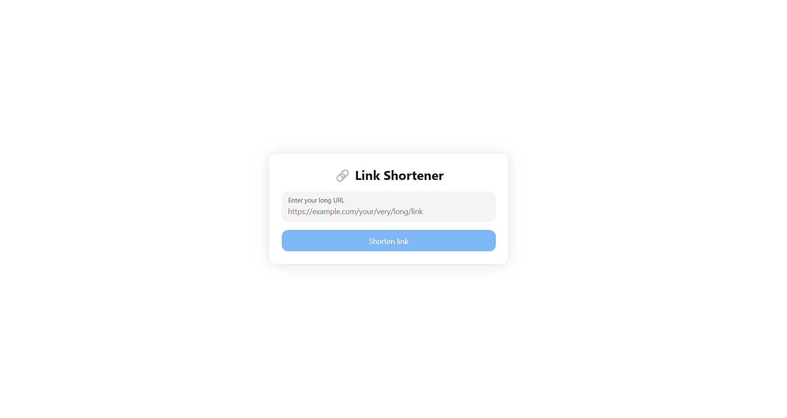

# Link Shortener

<p align="center">
  
</p>

A minimal URL shortener built with Next.js App Router and MongoDB. Paste a long URL, generate a short code, and use dynamic routing to redirect instantly.

> [!NOTE]
> This project uses **Server Actions** for URL creation and **MongoDB (Mongoose)** for link storage.

## Features

- Shorten long URLs into compact shareable links
- Redirect from `/{code}` to the original URL
- Clean UI with HeroUI components
- Toast feedback for success and failure states
- CI workflow for lint and build on push/PR to `main`

## Tech Stack

- Next.js 16 (App Router)
- React 19 + TypeScript
- HeroUI + Tailwind CSS v4
- MongoDB + Mongoose
- nanoid

## Project Structure

```text
app/                Next.js pages and routes
app/[code]/page.tsx Dynamic redirect route
components/         UI components for form/result
services/shorten.ts Server Action to create short URLs
models/Link.ts      MongoDB schema
lib/mongodb.ts      MongoDB connection helper
```

## Getting Started

### Prerequisites

- Node.js 20+
- pnpm 9+
- A MongoDB connection string

### 1. Install dependencies

```bash
pnpm install
```

### 2. Configure environment

Create `.env` in the project root:

```env
MONGODB_URI=your-mongodb-connection-string
```

### 3. Start development server

```bash
pnpm dev
```

Open http://localhost:3000.

## Available Scripts

- `pnpm dev`: Run local dev server
- `pnpm build`: Build for production
- `pnpm start`: Run production server
- `pnpm lint`: Run ESLint
- `pnpm format`: Format files with Prettier

## How It Works

1. User submits a URL from the homepage form.
2. `shortenUrl()` generates a 7-character code with `nanoid`.
3. The mapping is stored in MongoDB (`originalUrl` + `shortCode`).
4. Accessing `/{code}` looks up the record and redirects to the original URL.

## Deployment

Deploy on Vercel (recommended).

Set `MONGODB_URI` in your deployment environment before running the app.

## Support Files

- Contribution guide: [CONTRIBUTING.md](./CONTRIBUTING.md)
- Security policy: [SECURITY.md](./SECURITY.md)
- Code of conduct: [CODE_OF_CONDUCT.md](./CODE_OF_CONDUCT.md)
- License: [LICENSE](./LICENSE)
